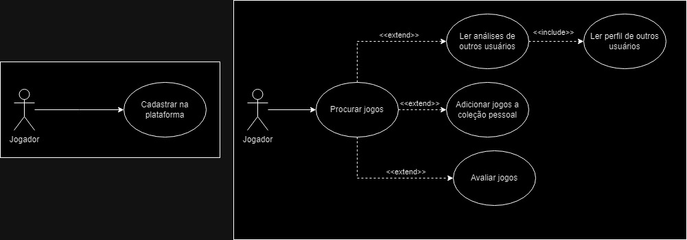
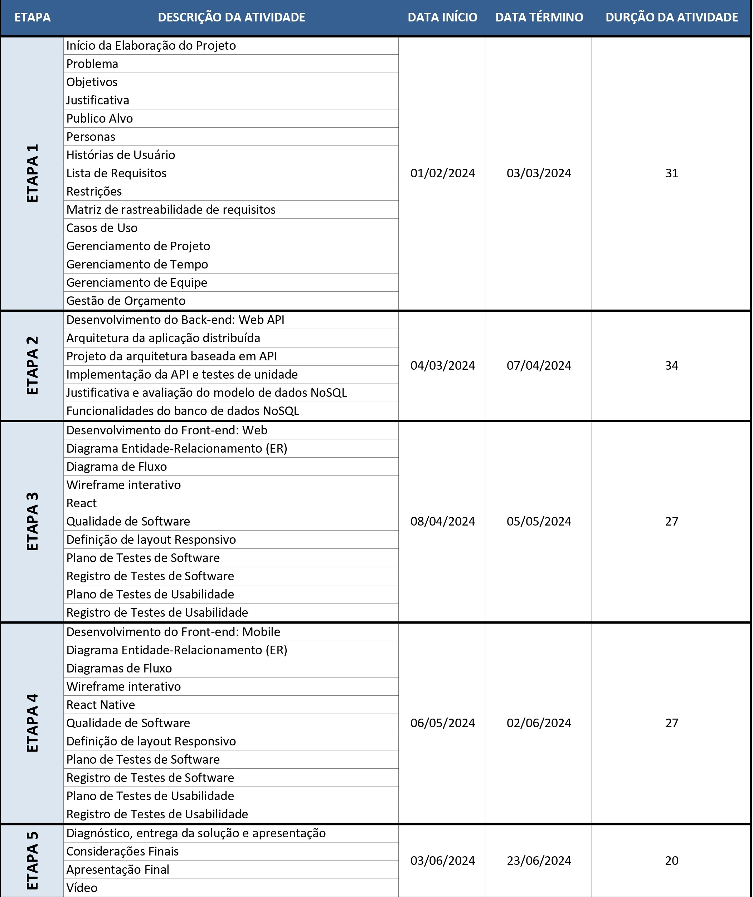
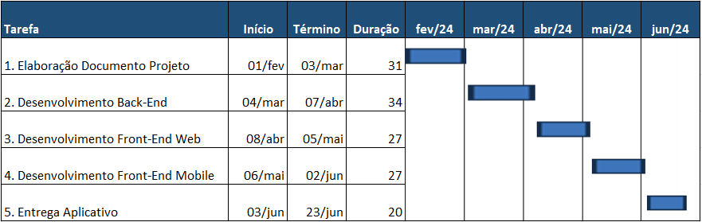
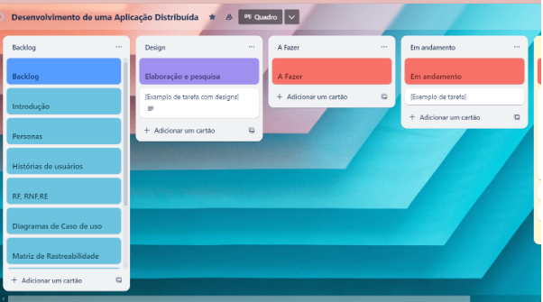

# Especificações do Projeto

<a href="1-Documentação de Contexto.md"> Documentação de Contexto</a>

A aplicação traz a solução para os usuários que são apaixonados por jogos e não querem perder tempo, pois através da mesma o usuário poderá adquirir referencias sobre os jogos, interagir com outros usuários e deixar sua opinião sobre o game.

Definição do problema e ideia de solução a partir da perspectiva do usuário. É composta pela definição do  diagrama de personas, histórias de usuários, requisitos funcionais e não funcionais além das restrições do projeto.

## Personas

* `Jenipher Santos`
   - Idade: 35 anos
   - História: Mãe solo, seu filho tem 10 anos, trabalha como administradora de uma empresa privada.
   - Motivações: Sempre busca ser melhor profissionalmente e como mãe.
   - Frustrações: Ter sempre que dar conta de tudo sozinha.
   - Aplicativos: Instagram e LinkedIn.
   - Hobbies, História: Ler, assistir filmes e séries, principalmente comédias românticas. Quando seu filho pede algum jogo, gosta de ter onde buscar informações sobre o jogo na internet, pois seu filho só tem 10 anos, não pode jogar qualquer tipo de jogo.
     
* `Mattheus Almeida`
   - Idade: 25 anos
   - História: Estudando de Análise e Desenvolvimento de Sistemas, estagiário de backend em uma empresa multinacional.
   - Motivações: Ser efetivado na empresa que trabalhar e poder comprar os jogos mais interessantes que encontrar.
   - Frustrações: Iniciou recentemente a vida de morar sozinho e tem medo de não dar conta de todas as despesas. 
   - Aplicativos: Instagram, Twitch, YouTube, TikTok.
   - Hobbies, História: Jogos online de computador, assistir animes e qualquer coisa do universo de super-heróis. Gosta sempre se estar antenado ao que as pessoas acham dos jogos.
     
* `Enzo Soares`
   - Idade: 12 anos
   - História: Está sempre ligado ao mundo dos jogos e começou a estudar desde novo como desenvolver jogos.
   - Motivações: Desenvolver um jogo nível Skyrim de complexidade e poder integrar a IA com seus jogos.
   - Frustrações: Ser obrigado a ir para a escola de manhã, se pudesse estudaria a tarde, mas seus pais acham importante o aprendizado de manhã. 
   - Aplicativos: Instagram, Twitch, YouTube, TikTok.
   - Hobbies, História: Gosta de ficar vendo reviews e game plays dos seus jogos favoritos para entender o que poderia funcionar no seu jogo ou não. 
     
* `Heloisa Faria`
   - Idade: 31 anos
   - História: Heloisa sempre gostou de jogos, até que fez disso seu ganha pão. Fazendo lives na Twitch e no Youtube ganhou milhares de seguidores.
   - Motivações: Mostrar que mulher não precisa ficar sensualizando nas plataformas enquanto joga para ganhar seguidores e poder jogar o que quiser.
   - Frustrações: Ver outros influenciadores de games homens tendo mais patrocinadores. 
   - Aplicativos: Instagram, Twitch, YouTube, TikTok.
   - Hobbies, História: Adora jogar Candy Crush quando ninguém mais está vendo, mas também ama bater em zumbis. Seria legal ter uma plataforma para postar o que acha dos jogos para os seus seguidores terem ideia do que está na sua lista.    
     
* `Rogério Duarte`
   - Idade: 43 anos
   - História: Casado, pai de dois filhos adolescentes, trabalha como engenheiro civil.
   - Motivações: Encontrar a família final do dia em casa e poderem jantar juntos. 
   - Frustrações: Problemas com alguma coisa na obra em que está trabalhando, algum fornecedor ou algo do tipo.  
   - Aplicativos: Facebook, LinkedIn e Youtube. 
   - Hobbies, História: Rogério gosta de passar muito tempo com a família, mas tira duas horas por final de semana para jogar jogos gratuitos que encontra nos fóruns da internet.  
     
* `Fernanda e Victor`
   - Idade: 27 e 31 anos
   - História: Eles trabalham como influenciadores de games, fazem game players de vários jogos, mas o foco é jogos de cooperação. 
   - Motivações: Poder criar conteúdo divertidos para a internet, focado para crianças e adolescentes e fazer o canal Diário do Casal Gamer chegar em 1 milhão de inscritos.  
   - Frustrações: Como fazem muita live de roblox para a criançada sentem que demoram mais para crescer do que outros gamers menos nichados. 
   - Aplicativos: Instagram, Twitch, YouTube, TikTok. 
   - Hobbies, História: Tem dois gatos, 1 peixe, 1 hamster e a Fernanda é uma amante de plantas e vegana. Adoram passar o tempo assistindo séries e filmes. Estão sempre em busca de jogos cooperativos para jogarem juntos para fazerem conteúdo ou só por diversão em casal.   

## Histórias de Usuários

Com base na análise das personas forma identificadas as seguintes histórias de usuários:

|EU COMO... `PERSONA`| QUERO/PRECISO ... `FUNCIONALIDADE` |PARA ... `MOTIVO/VALOR`                 |
|--------------------|------------------------------------|----------------------------------------|
|Jenipher  | encontrar uma plataforma confiável onde possa buscar informações sobre jogos adequados para a idade do meu filho        | garantir que meu filho esteja se divertindo de maneira segura e educativa enquanto joga             |
|Mattheus Almeida        | encontrar uma comunidade online onde possa obter opiniões e análises confiáveis sobre os jogos mais interessantes que encontro                | diminuir os gastos, investindo em jogos que realmente valem a pena |
|Enzo Soares  | ter acesso a reviews de meus jogos favoritos           | entender melhor o que funciona e o que não funciona em jogos similares ao que quero desenvolver               |
|Heloisa Faria       | encontrar uma plataforma onde possa compartilhar minhas opiniões sobre os jogos                | para promover uma mensagem positiva de igualdade de gênero no mundo dos jogos e para fornecer conteúdo valioso e autêntico para meus seguidores  |
|Rogério Duarte  | Encontrar jogos gratuitos e acessíveis para jogar durante minhas horas de lazer aos finais de semana.          | me divertir e relaxar, sem a necessidade de gastar dinheiro extra em entretenimento            |
|Fernanda e Victor       | Encontrar jogos cooperativos que possam jogar juntos               | criar conteúdo para seu canal e alcançar seu objetivo de atingir 1 milhão de inscritos em seu canal e continuar a criar conteúdo divertido e relevante para sua audiência  |

## Modelagem do Processo de Negócio 

### Análise da Situação Atual

Apresente aqui os problemas existentes que viabilizam sua proposta. Apresente o modelo do sistema como ele funciona hoje. Caso sua proposta seja inovadora e não existam processos claramente definidos, apresente como as tarefas que o seu sistema pretende implementar são executadas atualmente, mesmo que não se utilize tecnologia computacional. 

### Descrição Geral da Proposta

Apresente aqui uma descrição da sua proposta abordando seus limites e suas ligações com as estratégias e objetivos do negócio. Apresente aqui as oportunidades de melhorias.

### Processo 1 – NOME DO PROCESSO

Apresente aqui o nome e as oportunidades de melhorias para o processo 1. Em seguida, apresente o modelo do processo 1, descrito no padrão BPMN. 

### Processo 2 – NOME DO PROCESSO

Apresente aqui o nome e as oportunidades de melhorias para o processo 2. Em seguida, apresente o modelo do processo 2, descrito no padrão BPMN.

## Indicadores de Desempenho

Apresente aqui os principais indicadores de desempenho e algumas metas para o processo. Atenção: as informações necessárias para gerar os indicadores devem estar contempladas no diagrama de classe. Colocar no mínimo 5 indicadores. 

Usar o seguinte modelo: 

Obs.: todas as informações para gerar os indicadores devem estar no diagrama de classe a ser apresentado a posteriori. 

## Requisitos

As tabelas que se seguem apresentam os requisitos funcionais e não funcionais que detalham o escopo do projeto. Para determinar a prioridade de requisitos, aplicar uma técnica de priorização de requisitos e detalhar como a técnica foi aplicada.

### Requisitos Funcionais

|ID    | Descrição do Requisito  | Prioridade |
|------|-----------------------------------------|----|
|RF-001| A aplicação deve permitir que os usuários se cadastrem e façam o login usando e-mail e senha | ALTA | 
|RF-002| A aplicação deve possibilitar a busca de jogos por diversos critérios   | MÉDIA |
|RF-003| A aplicação deve oferecer aos usuários a capacidade de avaliar os jogos    | MÉDIA |
|RF-004| A aplicação deve oferecer a listagem da coleção de jogos do usuário e jogos que ele deseja adicionar a coleção   | ALTA |
|RF-005| A aplicação deve permitir ver críticas e análises de outros usuários sobre determinado jogo   | BAIXA |
|RF-006|A aplicação deve disponibilizar ferramentas para os usuários gerenciarem seus perfis  | BAIXA |
|RF-007| A aplicação deve permitir a visualização de coleção e reviews entre usuários  | BAIXA |
|RF-008| A aplicação deve oferecer a listagem de lançamentos do mês | BAIXA |

### Requisitos não Funcionais

|ID     | Descrição do Requisito  |Prioridade |
|-------|-------------------------|----|
|RNF-01| A aplicação deve ser compatível com múltiplas plataformas (web e mobile) para garantir acesso em diversos dispositivos   | Alta  | 
|RNF-02| O aplicativo deve ser executado em diferentes tamanhos/resoluções de telas.  |  Alta  | 
|RNF-03| O aplicativo deve fornecer fontes e elementos de interface com tamanho suficiente para garantir a legibilidade em dispositivos móveis.  |  Alta  | 
|RNF-04| O aplicativo deve ser funcional tanto em conexões Wi-Fi quanto em redes móveis.  |  Alta  | 
|RNF-05| O site deve ter bom nível de contraste entre os elementos da tela em conformidade.   |  Alta  | 
|RNF-06| O sistema poderá ser acessível por vários usuários ao mesmo tempo.  |  Alta  | 
|RNF-07| Deverá ser utilizado banco de dados NoSQL.  |  Alta  | 
|RNF-08| A aplicação deve respeitar as regras da LGPD (Lei Geral de Proteção de Dados Pessoais).  |  Alta  | 
|RNF-09| Dados sensíveis devem ser protegidos com medidas de segurança adequadas.   |  Alta  | 
|RNF-10| O aplicativo deve processar requisições do usuário em tempo razoável para garantir uma boa experiência do usuário.  |  Média  | 

## Restrições

O projeto está restrito pelos itens apresentados na tabela a seguir:

|ID| Restrição                                             |
|--|-------------------------------------------------------|
|RE-01| O sistema deve ter um componente para o backend, frontend web e um mobile.  |
|RE-02| O backend deve se portar como uma API, com rotas e os fronts devem consumir essa API.         |
|RE-03| O aplicativo disponibilizará apenas o idioma PT-BR.      |
|RE-04| A primeira etapa do projeto deverá ser entregue até: 03/03/24.        |
|RE-05| A segunda etapa do projeto deverá ser entregue até: 07/04/24.         |
|RE-06| A terceira etapa do projeto deverá ser entregue até: 05/05/24.        |
|RE-07| A quarta etapa do projeto deverá ser entregue até: 02/06/24.      |
|RE-08| O projeto completo deverá ser entregue até: 23/06/24.       |
|RE-09| Proibida a terceirização de desenvolvimento do sistema em sua totalidade ou de módulos isolados.       |
|RE-10| Restrito o projeto não utilizar APIs e/ou Web Services.         |

## Diagrama de Casos de Uso

# Gerenciamento de Projeto

De acordo com o PMBoK v6 as dez áreas que constituem os pilares para gerenciar projetos, e que caracterizam a multidisciplinaridade envolvida, são: Integração, Escopo, Cronograma (Tempo), Custos, Qualidade, Recursos, Comunicações, Riscos, Aquisições, Partes Interessadas. Para desenvolver projetos um profissional deve se preocupar em gerenciar todas essas dez áreas. Elas se complementam e se relacionam, de tal forma que não se deve apenas examinar uma área de forma estanque. É preciso considerar, por exemplo, que as áreas de Escopo, Cronograma e Custos estão muito relacionadas. Assim, se eu amplio o escopo de um projeto eu posso afetar seu cronograma e seus custos.

## Gerenciamento de Tempo

Ter estabelecido quais as atividades são necessárias entregar e o prazo correto, facilita o desenvolvimento organizado e estruturado do projeto, aumentando o desempenho e minimizando os erros e retrabalhos, mediante isso detalhamos todas as atividades a serem entregues no período do projeto, demonstrando de forma visual através do diagrama de Gantt.

O diagrama de Gantt é uma ferramenta visual utilizada para controlar e gerenciar o cronograma de atividades de um projeto. Com ele, é possível listar tudo que precisa ser feito para colocar o projeto em prática, dividir em atividades e estimar o tempo necessário para executá-las.

## Gerenciamento de Equipe

Para organização e distribuição das tarefas do projeto, a equipe está utilizando o Trello estruturado com as seguintes listas: 

● Backlog: recebe as tarefas a serem trabalhadas e representa o Product Backlog. Todas as atividades identificadas no decorrer do projeto também devem ser incorporadas a esta lista. 

● A fazer: Esta lista representa o Sprint Backlog. Este é o Sprint atual que estamos trabalhando. 

● Em andamento: Quando uma tarefa tiver sido iniciada, ela é movida para cá. 

● Revisão: Antes de mover para a lista de concluído, revisamos o que foi feito para ver se existe algum erro. 

● Concluído: nesta lista são colocadas as tarefas que passaram pelos testes e controle de qualidade e estão prontos para ser entregues ao usuário. Não há mais edições ou revisões necessárias, ele está agendado e pronto para a ação. 

O quadro kanban do grupo desenvolvido na ferramenta de gerenciamento de projetos está disponível através da URL (https://trello.com/invite/b/laNutvgs/ATTI84423f9114e3b185216f781446c0db2341A6FCB4/desenvolvimento-de-uma-aplicacao-distribuida) e é apresentado, no estado atual, na figura abaixo: 

## Gestão de Orçamento

A gestão do orçamento é uma das etapas mais importantes do projeto, nesta fase é calculado todos os gastos que terá no decorrer do projeto, além do lucro que se espera ter com o trabalho que está vendendo, no entanto trata-se de um trabalho minucioso e muito preciso, devido a oscilação de preços a cada dia que se passa. Embora trabalhemos com estimativa, a ideia é enxugar o máximo possível para obter lucro sem que falte algo importante a orçar.

 

# Apresentação Projeto

https://github.com/ICEI-PUC-Minas-PMV-ADS/pmv-ads-2024-1-e4-proj-infra-t5-pmv-ads-2024-1-e4-proj-infra-t5-grupo03/blob/97665ce6068a0b1bdd553312caab5c3651164ed0/FAVGAMER.mp4
