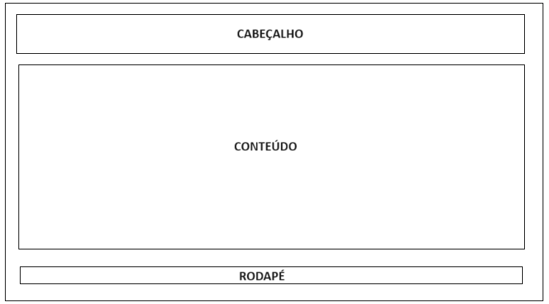
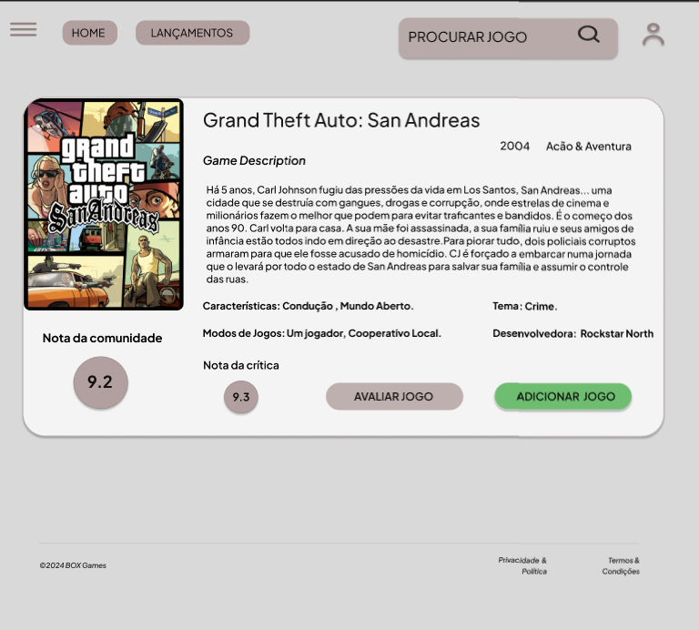
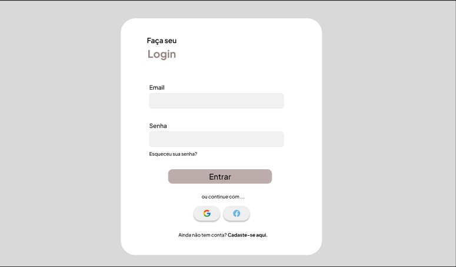
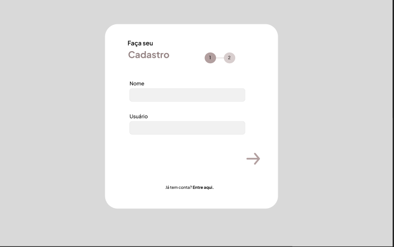
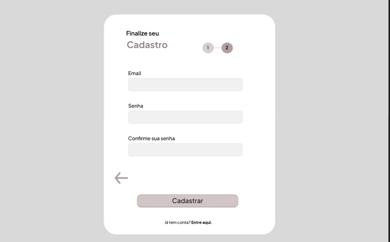
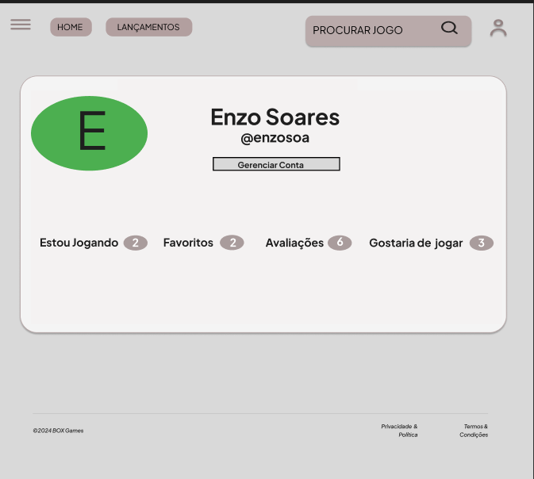

# Projeto de Interface

Pré-requisitos: <a href="2-Especificação do Projeto.md"> Documentação de Especificação</a>

Visão geral da interação do usuário pelas telas do sistema e protótipo interativo das telas com as funcionalidades que fazem parte do sistema (wireframes).

 Apresente as principais interfaces da plataforma. Discuta como ela foi elaborada de forma a atender os requisitos funcionais, não funcionais e histórias de usuário abordados nas <a href="2-Especificação do Projeto.md"> Documentação de Especificação</a>.

## Diagrama de Fluxo

O diagrama apresentado na figura abaixo mostra o fluxo de interação do usuário pelas telas do sistema. Cada uma das telas deste fluxo é detalhada na seção de Wireframes que se segue. Para visualizar o wireframe interativo, acesse o ambiente Figma do projeto: https://www.figma.com/file/2SSfyFP64x8y0taxMG07K6/Box-Games?type=design&node-id=0-1&mode=design&t=Z8qRvy0Xe2k7xog5-0

## Wireframes

Conforme o fluxo de telas do projeto, apresentado no item anterior, as telas do sistema são detalhadas a seguir. As telas do sistema apresentam uma estrutura comum que é apresentada abaixo. Nesta estrutura, existem 3 grandes blocos, descritos a seguir. São eles: Cabeçalho - local onde são dispostos elementos fixos de identidade (logo). Conteúdo - apresenta o conteúdo da tela em questão. Rodapé: informações sobre o site.   

 
 ## HomePage
 A tela de home-Page mostra vários jogos a partir da API utilizada pelo sistema. Com base na estrutura padrão a barra superior traz a barra de pesquisa e acesso a 3 elementos distintos: <b>
Componente “Home” que leva o usuário ao menu principal. Componente “Lançamentos” que direciona os usuários aos últimos jogos lançados. Componente Login que encaminha o usuário à página de login.
O bloco conteúdo traz os jogos mais procurados e a avaliação. 
Rodapé: nome do site, políticas de privacidade e termos e condições.  

  

 ## Tela – Jogo
 A tela de jogo apresenta a descrição detalhada do jogo, incluindo informações como nota, tema, ano de lançamento, gênero, modos de jogo e desenvolvedor.  

  

  ## Tela – Login
  A tela de login apresenta um formulário com os campos "e-mail" e "senha", além do botão "entrar", para que o usuário autentique sua identidade e obtenha acesso a recursos e funcionalidades específicas dentro do site. Também inclui o componente "esqueceu sua senha" para redefinição de senha e o componente "criar conta" para usuários não cadastrados.  

  

  ## Tela –Cadastro1
  Esta tela exibe um formulário com os campos "nome" e "usuário" para que o usuário inicie seu processo de cadastro.  

  

  ## Tela –Cadastro2
  Nesta etapa final do cadastro, é apresentado um formulário com os campos "e-mail", "senha" e "confirmar senha". Ao clicar no botão "cadastrar", o usuário finaliza seu cadastro.  

  

   ## Tela – Perfil
   Fornece uma visão abrangente do jogador, suas preferências de jogo e suas atividades no site de avaliação de jogos.  
   
  