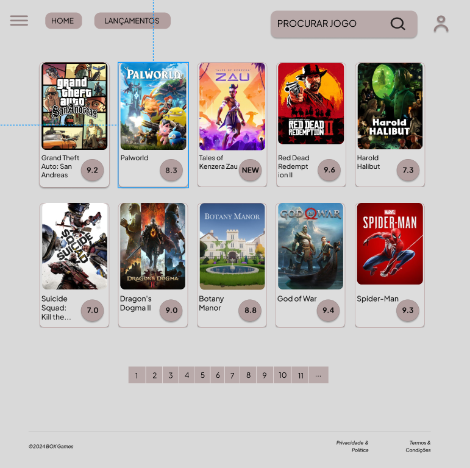
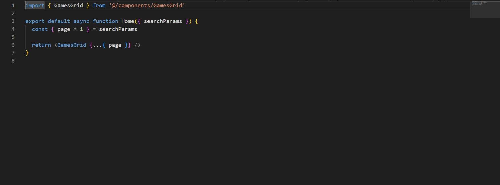
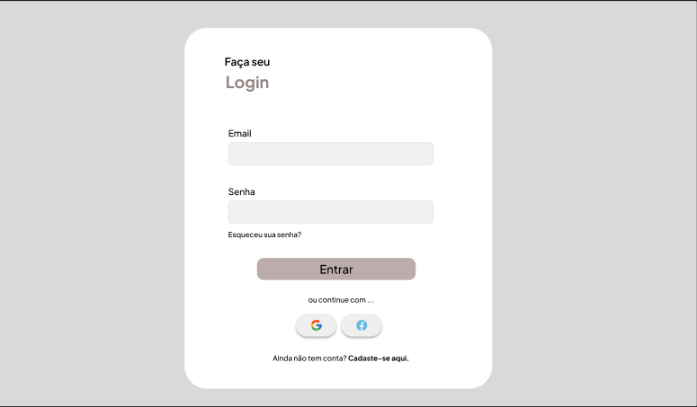
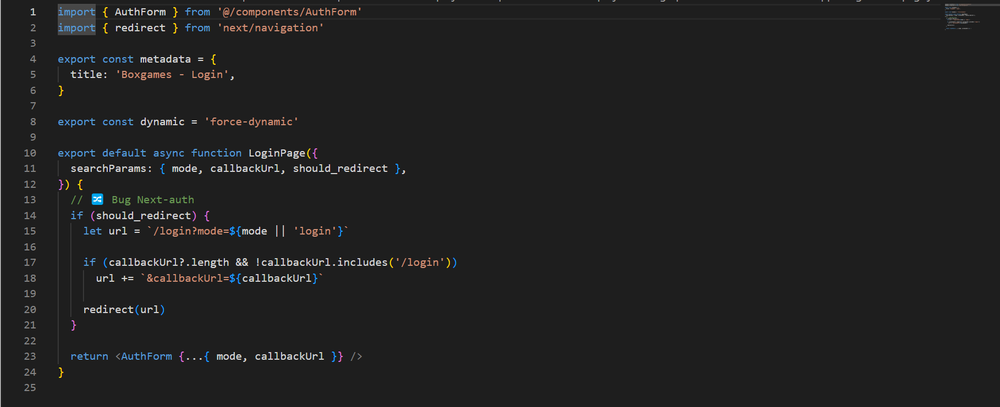
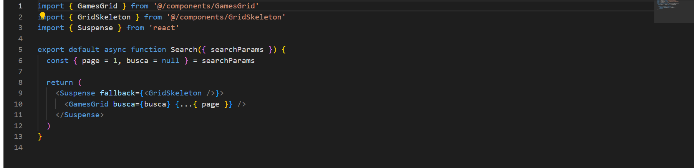

# Programação de Funcionalidades

## HomePage

A tela de home-Page mostra vários jogos a partir da API utilizada pelo sistema. Com base na estrutura padrão a barra superior traz a barra de pesquisa e acesso a 3 elementos distintos.Um exemplo da tela é apresentada na Figura abaixo:    

  

Requisitos atendidos: 

- RF-008    

Estrutura de dados: 

 

## Tela – Login

  A tela de login apresenta um formulário com os campos "e-mail" e "senha", além do botão "entrar", para que o usuário autentique sua identidade e obtenha acesso a recursos e funcionalidades específicas dentro do site. Um exemplo da tela é apresentada na Figura abaixo:    

    

  Requisitos atendidos: 

- RF-001, 006   

Estrutura de dados: 

    

  ## Tela – Pesquisa

  Componente na Home page que possibilita a busca de jogos por diversos critérios   

   

  Requisitos atendidos: 

- RF-002    

Estrutura de dados: 

    
