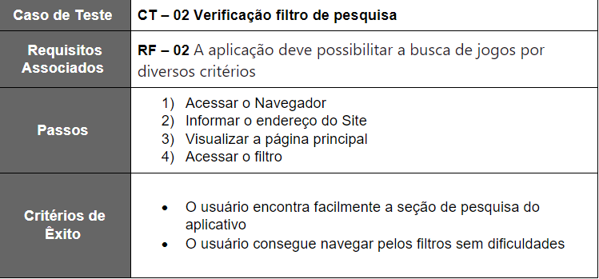
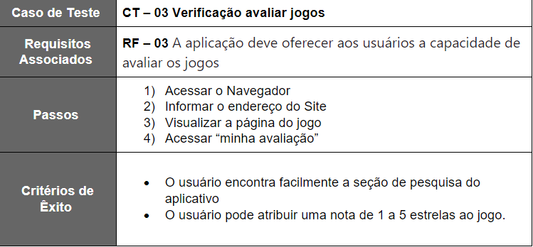
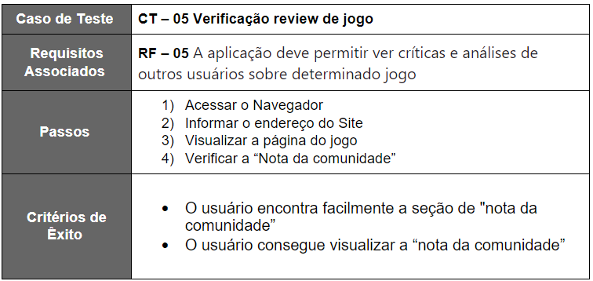
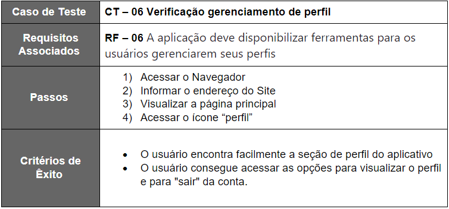
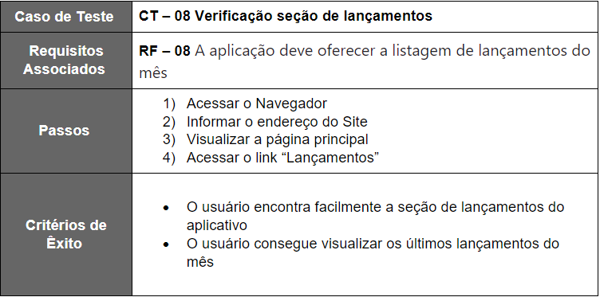

# Plano de Testes de Software

Pré-requisitos: <a href="2-Especificação do Projeto.md"> Especificação do Projeto</a>, <a href="3-Projeto de Interface.md"> Projeto de Interface</a>

 ## RF-02

 

 ## RF-03

 

 ## RF-05

 

 ## RF-06

 

 ## RF-08

 
