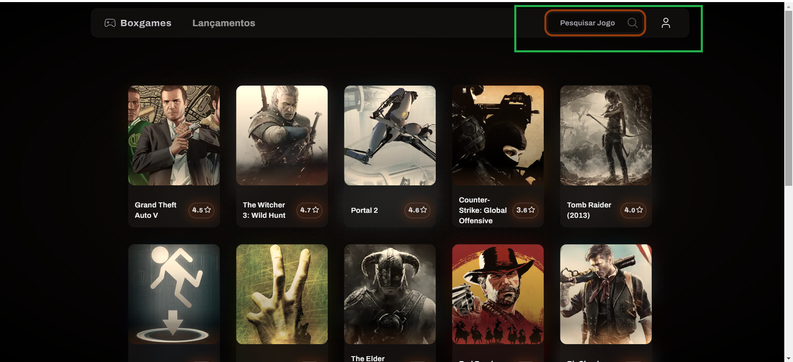
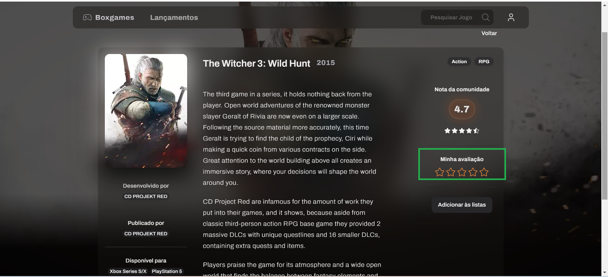
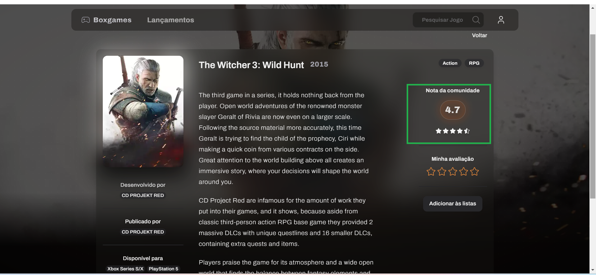
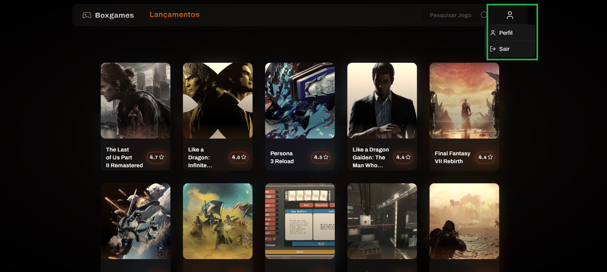
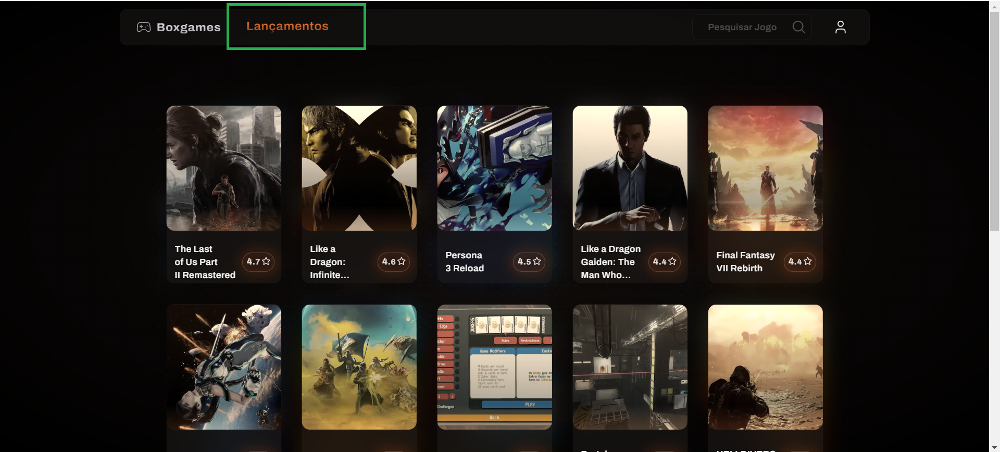

# Registro de Testes de Software
Os resultados obtidos nos testes de software realizados são descritos abaixo. 

## Registro de Testes do RF-02

**CT-02**-Visualizar Filtro de pesquisa 
Conforme apresentado na imagem abaixo, a página principal carrega completamente, apresentando o filtro para pesquisa.  

  

## Registro de Testes do RF-03

**CT-03**-Visualizar avaliar jogos 
Conforme apresentado nas imagens abaixo, a página principal carrega completamente, apresentando a seção "minha avaliação".  

  

## Registro de Testes do RF-05

**CT-05**-Visualizar alimentos da estação 
Conforme apresentado na imagem abaixo, a página principal carrega completamente, apresentando a seção "nota da comunidade".  

  

## Registro de Testes do RF-06

**CT-06**-Visualição de área para logar 
Conforme apresentado na imagem abaixo, a página principal carrega completamente, apresentando a seção de perfil.  

  

## Registro de Testes do RF-08

**CT-08**-Visualizar  lançamentos do mês 
Conforme apresentado na imagem abaixo, a página principal carrega completamente, apresentando a seção de "lançamentos".  

  