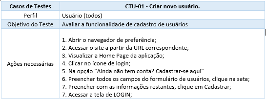

# Plano de Testes de Usabilidade
Avaliações são conduzidas para verificar o funcionamento e conformidade da ferramenta com os requisitos e especificações estabelecidos durante o planejamento do sistema. Cada componente é testado para garantir que o sistema responda corretamente às solicitações feitas.

Através do teste de usabilidade, é possível avaliar a qualidade da interface do usuário em uma aplicação interativa, utilizando observação para coletar dados sobre o comportamento e as reações dos usuários em relação a diferentes layouts e funcionalidades. Após a realização desses testes, uma análise de usabilidade é feita para identificar as principais dificuldades e realizar melhorias na plataforma, visando proporcionar uma experiência melhor ao usuário.

O plano de teste de usabilidade para a aplicação Boxgames inclui: descrição dos requisitos do teste, método utilizado, objetivos do teste de usabilidade e um roteiro detalhado das tarefas realizadas pelos usuários. Além disso, são listados os parâmetros adotados no plano de teste de usabilidade.

Para cada voluntário do teste, é fundamental coletar e apresentar todos os dados/métricas previamente definidos.

### Teste Presencial de Usabilidade
Os testes presenciais de usabilidade de uma aplicação web envolvem a participação de usuários reais que interagem diretamente com a interface da aplicação em um ambiente controlado. Esses testes têm como objetivo principal avaliar a experiência do usuário ao utilizar a aplicação e identificar possíveis problemas de usabilidade.

Durante os testes presenciais, os usuários são convidados a realizar uma série de tarefas específicas, seguindo um roteiro pré-definido. Os testes podem ser conduzidos individualmente ou em grupos, dependendo das necessidades e recursos disponíveis.

Enquanto os usuários realizam as tarefas, são observados e registrados diversos aspectos, como o tempo que levam para concluir cada tarefa, as ações que executam, os erros que cometem e suas reações emocionais. Essas observações podem ser feitas por meio de anotações, gravações de vídeo e áudio, questionários ou entrevistas.

Além disso, os testes presenciais também permitem coletar feedback direto dos usuários, por meio de perguntas e discussões após a conclusão das tarefas. Esse feedback é extremamente valioso para compreender as percepções dos usuários sobre a aplicação, suas opiniões, sugestões de melhorias e pontos problemáticos identificados.

Com base nos resultados dos testes presenciais de usabilidade, é possível identificar problemas de design, fluxos confusos, funcionalidades pouco intuitivas ou dificuldades de navegação. Essas informações podem ser utilizadas para realizar ajustes e melhorias na interface da aplicação, visando proporcionar uma experiência mais satisfatória e eficiente para os usuários.

### Objetivos do teste:
- Identificação de problemas
  > O objetivo principal é encontrar e resolver quaisquer problemas que possam existir na plataforma, bem como identificar obstáculos que possam dificultar a utilização fluida da aplicação.
- Teste de aprendizado
  > Será realizado um teste de experimentação, onde uma pessoa sem experiência prévia com a ferramenta deverá começar do zero para realizar uma tarefa específica. O objetivo é avaliar como os usuários aprendem a usar a aplicação e identificar possíveis dificuldades de aprendizado.

  ### Perguntas que a avaliação pretende responder:
- Os usuários conseguem navegar facilmente entre os principais componentes do sistema?
- O tempo de resposta do sistema causa erros ou frustração para os usuários?
- As telas da aplicação correspondem às expectativas e ao entendimento dos usuários sobre como o sistema deveria funcionar?
- Quais são os obstáculos que estão impedindo os usuários de concluir suas tarefas com sucesso?

### Perfil do usuário:
Os usuários serão escolhidos com base nas personas definidas na metodologia do projeto, levando em consideração suas preferências pela leitura e a correspondência de suas características com as personas e histórias de usuários estabelecidas. Isso inclui a seleção de usuários como pessoas aposentadas, com deficiência visual, idosas, escritoras e estudantes, entre outros.

### Procedimento de teste
- Recepcionar o participante e fornecer explicações sobre o Termo de Consentimento Livre e Esclarecido (TCLE);
- Orientar o participante sobre os objetivos do teste, garantindo o anonimato e explicando a forma de observação (por acompanhamento);
- Realizar o teste, apresentando cenários de tarefas específicas e registrando as medições relevantes;
- Realizar um debriefing com o participante, conduzindo uma entrevista pós-teste e discutindo seus comentários gerais sobre o produto e suas preferências.

### Requisitos do ambiente/equipamento de teste
Os requisitos para realização dos testes são:
- Conectividade de internet por dados móveis ou por banda larga;
- Navegador da internet-Chrome, Firefox, Opera ou Edge;
- Disponibilidade do usuário em comparecer no local para teste.

### Método utilizado: Observação direta, medição e Avaliação
Serão selecionados seis participantes para realizar um teste no qual eles avaliarão como o site se desempenha e interage, levando em consideração as necessidades que estão alinhadas com o propósito da aplicação, além de oferecer sugestões para melhorias.
Os participantes terão a responsabilidade de analisar de maneira eficiente um conjunto de tarefas atribuídas a eles e fornecer feedback sobre a usabilidade da aplicação.

Para cada tarefa do participante poderemos medir: eficácia, eficiência e satisfação

> Conclusão de tarefas sem erro 
> Conclusão de tarefa com erro 
> Quantidade total de cliques 
> Tempo de execução da tarefa 
> Satisfação ao realizar uma tarefa - pedir para o usuário avaliar através de escala 1 a 5

### Serão acompanhadas de perto as seguintes tarefas: observação direta, medição e avaliação.
Aqui estão as atividades a serem realizadas pelos participantes, que serão cuidadosamente observadas:

