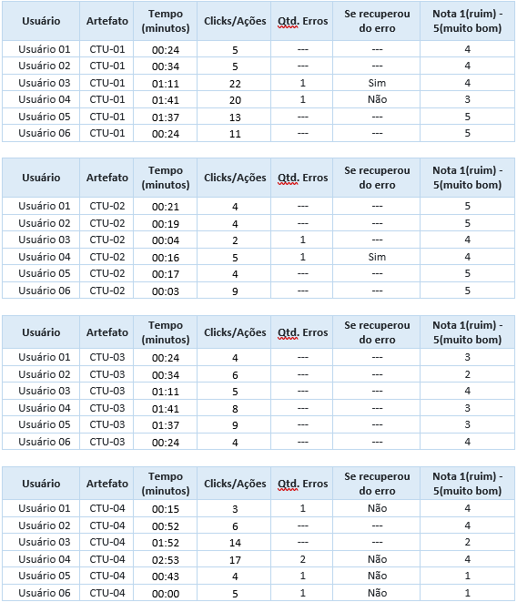
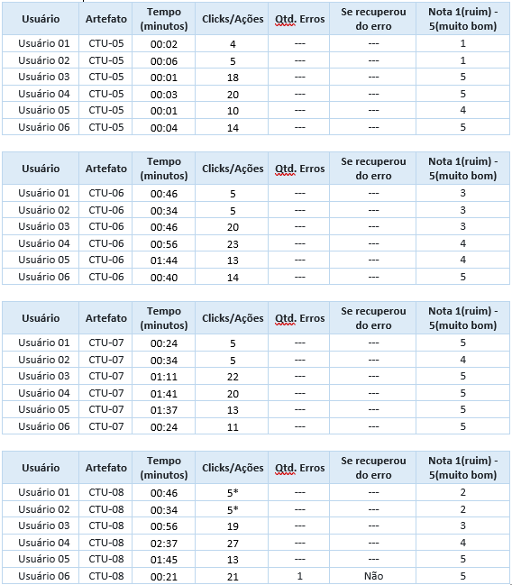

# Registro de Testes de Usabilidade
O Registro de Testes de Usabilidade é um relatório que contém as evidências dos testes e relatos dos usuários participantes, baseado no Plano de Testes de Usabilidade desenvolvido para os casos de uso desta etapa.
Esses testes geralmente envolvem a observação de um grupo de usuários enquanto eles realizam tarefas específicas dentro do sistema ou produto em questão. Os usuários são instruídos a realizar tarefas que simulem situações reais de uso e seus comportamentos são observados por um ou mais observadores.
Os dados coletados durante o teste de usabilidade são usados para identificar problemas de usabilidade, bem como para avaliar a satisfação do usuário, a eficácia do design, a eficiência da interação e outros fatores relevantes. Com base nessas informações, os designers e desenvolvedores podem fazer ajustes e melhorias na interface para torná-la mais intuitiva e fácil de usar.

Foi elaborado um formulário com perguntas onde os participantes foram questionados sobre as funcionalidades de usabilidade.

Participantes: 6

<h2>Observações e conclusão</h2>

Nossos testes foram realizados com os seguintes voluntários: 

Usuário 01: Mulher, 27 anos, ensino superior completo. 
Usuário 02: Homem, 27 anos, ensino superior completo. 
Usuário 03: Mulher, 53 anos, ensino superior completo. 
Usuário 04: Homem, 46 anos, ensino médio completo. 
Usuário 05: Mulher, 43 anos, ensino superior completo. 
Usuário 06: Mulher, 28 anos, pós graduada. 

<h2>Relatório</h2>

**Teste de Usabilidade da aplicação Boxgames: estudo de caso**

Seguem resultados: 

**01 - Criar novo usuário.** 

Média da nota: 4,16

Sugestões e considerações dos usuários: 
- Na hora de criar a senha poderia ter uma mensagem avisando que a senha tem que ter uma letra maíucula, uma letra minúscula, um número
e no minimo 6 caracteres.

**02 - Realizar o LOGIN** 

Média da nota: 4,66

Um usuário teve um erro e conseguiu se recuperar.

**03 - Pesquisa de Jogo** 

Média da nota: 3,16

Ao final do teste dois usuários questionaram que não encontraram os jogos que queriam.

Sugestões e considerações dos usuários: 
- Aumentar o repertório de jogos. 
- Disponibilizar a busca do jogo em portugues e ingles.

**04 - Lançamentos**

Média da nota: 2,66

Quatro usuários tiveram problemas e não conseguiram localizar o jogo que estavam procurando.

Sugestões e considerações dos usuários: 
- Aumentar o repertório de jogos. 
- Disponibilizar a busca do jogo em portugues e ingles.

**05 - Botão Voltar**

Média da nota: 3,50

Sugestões e considerações dos usuários: 
- Destacar o botão, pois os usuários não estam enxergando a opção de voltar

**06 - Avaliar Jogos".** 

Média da nota: 3,66

Sugestões e considerações dos usuários: 
- Imputar uma mensagem informando que a avaliação foi realizada com o sucesso, pois os usuários não sabiam se a avaliação dele havia ou não sido realizada.

**07 - Adicionar os jogos na Listas de Favoritos, Jogando, Finalizado, Peguei Emprestado, Na Fila, Jogar Novamente, Lista de Desejo.** 

Média da nota: 4,83

Sugestões e considerações dos usuários: 
- Imputar uma mensagem informando que o jogo foi adicionado na lista escolhida com o sucesso.

**08 - Acessar "Minhas Coleções".** 

Média da nota: 3,50

Um usuário não preencheu Recorrência e teve um Erro.

Sugestões e considerações dos usuários: 
- Separar os jogos por listas;
- Disponibilizar os jogos por ordem alfabética, data de inclusão, último acesso.

  **Plano de correção:**

| **Correção** | **Foi implementada?** |
| --- | --- |
| Indicar visualmente os requisitos obrigatórios da criação de senha no login e alterar senha dentro do usuário | A ser implementado |
| Aumentar o repertório de jogos | A ser implementado |
| Disponibilizar a busca dos jogos em português e inglês | A ser implementado 
| Destacar o botão "Voltar" para a página Home | Implementado |
| Disponibilizar a mensagem que a avaliação foi realizada com sucesso | A ser implementado |
| Imputar a mensagem informando que o jogo foi adicionado a lista | A ser implementado  |
| Separar jogos por lista na área logada | Implementado |
| Criar filtro para jogos que foram adicionados as listas | A ser implementado  |

**Conclusão**

Média final do teste: 3,76

A realização dos Testes de Usabilidade com usuário reais são extremamente importantes para pegar falhas que nós desenvolvedores estamos viciados em ignorar enquanto testamos a aplicação. 
